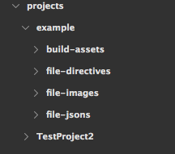
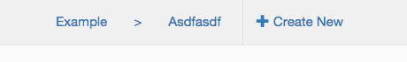
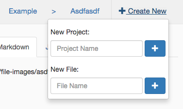
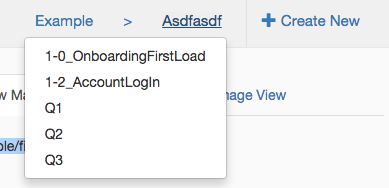

# Spec Builder
Spec Builder is a web-app created to normalize and improve the design/developer production cycle. Through the use of a common GUI, designers are able to wire-frame the look and interactions of every page of an application they are creating. The Spec Builder creates a page layout in various formats such as Markdown for readability and JSON for extendability so that a developer can quickly and easily get to developing. This tool will cut down the "back and forth" time between developers and designers allowing applications to be rolled out to market and clients faster.

## Build and Run Instructions

Once the repo has been cloned all that is needed to build the project is to run `bower install` and `npm install`.

In order to run and use the app you need to run a local server at the root directory of the project (any local server should work such as [http-server](https://www.npmjs.com/package/http-server)). A seperate node server for the File API also needs to be run from the root directory by running `node server.js`.

## File Structure

Projects are stored in the top level directory called `Projects`. Each project has it's own directory (named the same as the project) and has 4 subdirectories (`build-assets`, `file-directives`, `file-images`, `file-jsons`) that reside inside. Upon creation of a project, a new directory will be added to the `Projects` directory and the 4 corresponding directories will also be created at that time. 

An example of the structure is shown below:

The directory `file-images/` is where the screen images of all pages are stored. Uploading must be done manually and the image for the file needs to have the same base name as its file. For example, if the file in question is called `UserLoginForm` then the corresponding path to its image would need to be `/file-images/UserLoginForm.png`. The application defaults to use PNG however any valid image format can be used.

The directory `build-assets/` is where all the Build In/Out's are stored for the project. They must also be uploaded manually but can have any file name.

## Creation/Deletion

Projects can only be created in the navbar dropdown labeled '+ Create New'. Files can be created in two places, the '+ Create New' dropdown and in the body of the application in the left panel. In order to create a file, a project _must_ be selected first. When a file is created, the server will create two corresponding files: one in `file-directives/` and one in `file-jsons/`. Files in the `file-directives/` directory will be used to populate the GUI with the file objects and files in the `file-jsons/` are used to store the document object for the various views (Markdown, JSON, etc).

In order to delete a file you must first select the file and by the file name in the left panel there there will be a delete button in. Users must take caution when deleting files because this action cannot be undone. Upon confirming deletion, the server will delete the corresponding files in `file-directives/` and `file-jsons/`.

## Project/File Selection
Project and File can be done through the URL or through the navbar. Using the URL, the selection would be formatted as `baseurl.com/#/exampleProject/exampleFile` where exampleProject and exampleFile are the project and file name respectively. If you'd only like to select a project, you can ommit the file name in the url like so: `baseurl.com/#/exampleProject`. The second way to select a project or file is through the navbar by clicking on either 'Project' or 'File'. The words 'Project' and 'File' may be replaced if you currently have a project or file selected.

